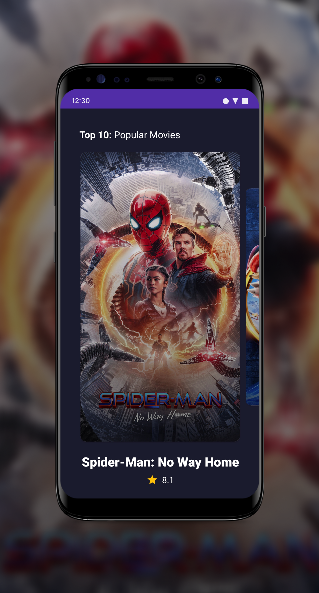
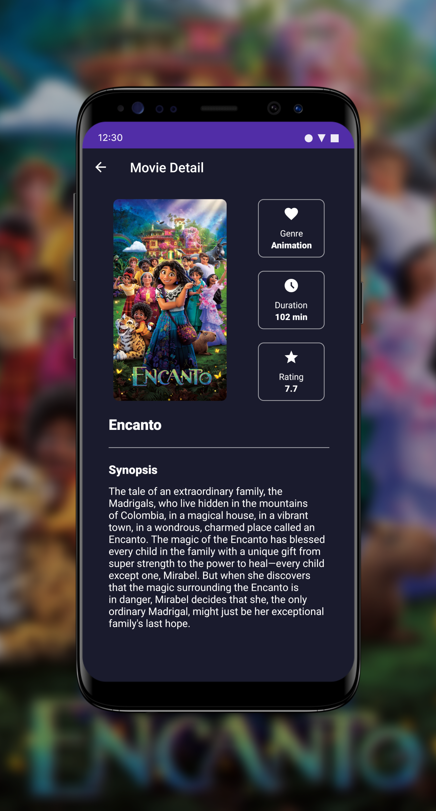

# Top 10 Movies - Android

**This is a <ins>Non-Commercial</ins> project, we do not interfere
with [TMDB](https://www.themoviedb.org/terms-of-use) copyrights. We agree
with [CC BY 4.0](https://creativecommons.org/licenses/by/4.0/)
and [CC BY-NC 3.0](https://creativecommons.org/licenses/by-nc/3.0/igo/)**

 
 

     
     
     

## Description

You'll be able to follow the top 10 movies in the world.

## Product feature

- Top 10 movies
- Movies' detail
- Offline usage
- CI with [Github Actions](https://github.com/OBrunoVieira/husqvarna-challenge/actions)

## Modules

- `app` &mdash; module that provide the mobile application itself
- `core` &mdash; module that share common business logic (such as network configuration, data state
  and so on.)
- `tokens` &mdash; module that share common UI units (such as strings, colors, dimens, custom views
  and so on.)
- `home` &mdash; module that provide the Home's screen
- `movie` &mdash; module that provide structures to present the list of popular movies and its top
  10.
- `movie-details` &mdash; module that provide structures to present movie's detail

## Credits

- [@obrunovieira - Android Developer](https://www.linkedin.com/in/obrunovieira/)

## 3rd party APIs used

- [TMDB API](https://developers.themoviedb.org/3/)

## 3rd party libraries used

- [Koin](https://github.com/InsertKoinIO/koin)
- [Retrofit](https://github.com/square/retrofit)
- [Glide](https://github.com/bumptech/glide)
- [KTX](https://developer.android.com/kotlin/ktx)
- [ViewPager2](https://developer.android.com/jetpack/androidx/releases/viewpager2)
- [Coroutines](https://github.com/Kotlin/kotlinx.coroutines)

## Sources

* [TMDB](https://www.themoviedb.org/)
